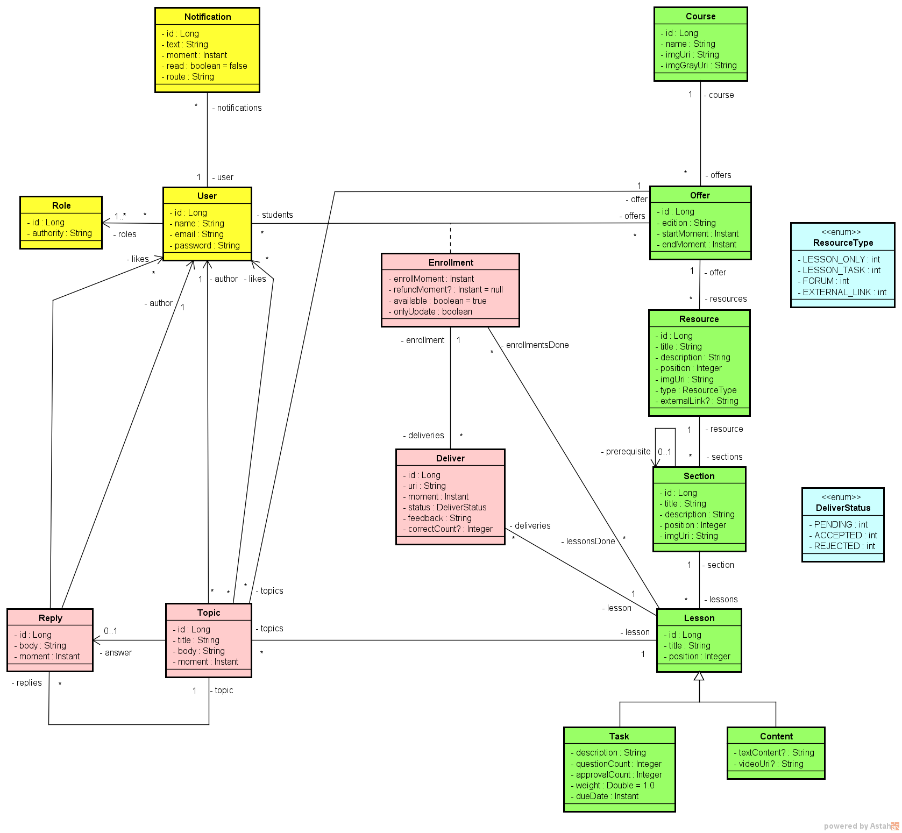
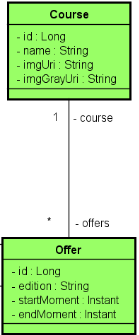
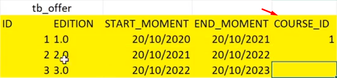
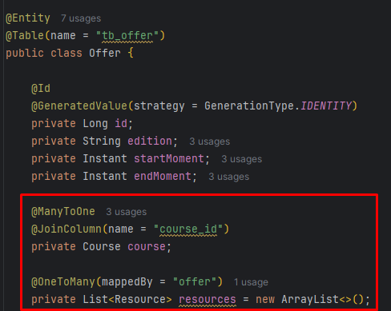
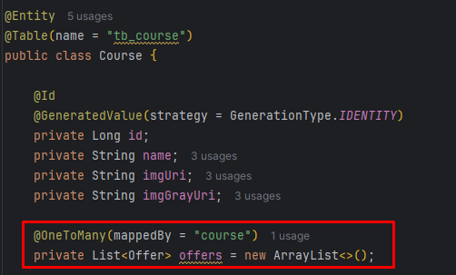
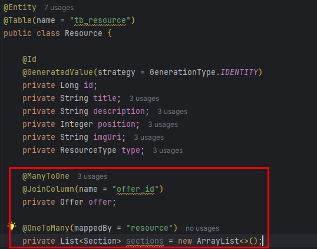
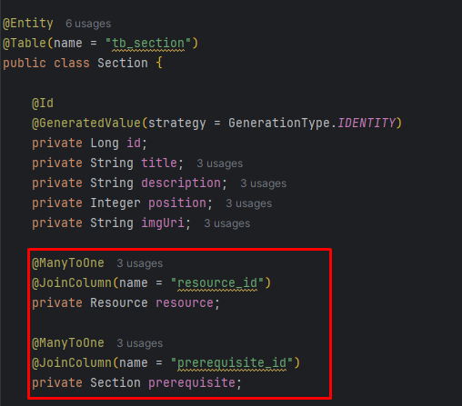
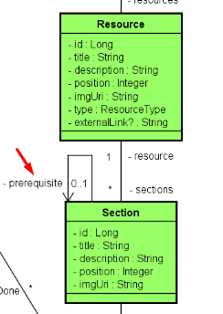

<p align="center">
  
</p>

# Objetivo: Relembrar sobre mapeamento



# Mapeando

## User, Role

Como podemos ver no diagrama acima. A classe User é quase indepedente, não precisamos nos preocupar com as outras para cadastar um usuário (somente com Role, terá no minimo uma role).

Para mapear ambas, sempre usar nossa caixa de ferramenta. Neste caso, usuaremos a do [DSCatalog](https://github.com/zenonxd/casos-uso-signup-finalizacao/tree/e07af093dfb15cbdab178f8475edb683e48fb483/src/main/java/com/devsuperior/dscatalog/entities)

### SeedSQL

```sql
INSERT INTO tb_user (name, email, password) VALUES ('Alex Brown', 'alex@gmail.com', '$2a$10$eACCYoNOHEqXve8aIWT8Nu3PkMXWBaOxJ9aORUYzfMQCbVBIhZ8tG');
INSERT INTO tb_user (name, email, password) VALUES ('Maria Green', 'maria@gmail.com', '$2a$10$eACCYoNOHEqXve8aIWT8Nu3PkMXWBaOxJ9aORUYzfMQCbVBIhZ8tG');

INSERT INTO tb_role (authority) VALUES ('ROLE_STUDENT');
INSERT INTO tb_role (authority) VALUES ('ROLE_INSTRUCTOR');
INSERT INTO tb_role (authority) VALUES ('ROLE_ADMIN');


INSERT INTO tb_user_role (user_id, role_id) VALUES (1, 1);
INSERT INTO tb_user_role (user_id, role_id) VALUES (2, 1);
INSERT INTO tb_user_role (user_id, role_id) VALUES (2, 2);
INSERT INTO tb_user_role (user_id, role_id) VALUES (2, 3);
```

## ManyToOne (Course & Offer / Resource & Offer / Section & Resource)



Prestemos atenção em como as classes estão declaradas na imagem. O própria diagrama UML nos indica: "course" e "offers".

❓ Por que a relação é ManyToOne?

É possivel ver no diagrama: Do lado do offers temos um *, ou seja, MUITOS. Já no lado do Course um "1".

Logo, "uma oferta pode ter um curso. um curso, pode ter várias ofertas".

Do lado da oferta, temos a referência para UM curso.

Do lado do curso, temos a referência para VÁRIAS ofertas.


Bom, ao inserirmos na entidade Offer a entidade Course, será criado o banco de dados uma coluna, uma chave estrangeira referenciando o curso, exemplo no excel:



Portanto, precisamos fazer o mapeamento no JPA. Para fazer isso, é só colocar @JoinColumn com o nome da chave estrangeira 😊

EM RESUMO: 

A classe com *, receberá a outra classe (somente ela importada, no singular) com a anotação @ManyToOne + JoinColumn(name = "nomeclasse_id").

A classe com "1", receberá a outra classe (em list/set, no plural) com a anotação @OneToMany(mappedBY).

### Seed Course

```sql
INSERT INTO tb_course (name, img_Uri, img_Gray_Uri) VALUES ('Bootcamp HTML', 'https://www.nibs.in/wp-content/uploads/2020/12/ss1.jpg', 'https://static.vecteezy.com/system/resources/previews/023/450/641/non_2x/education-line-icon-college-illustration-sign-study-symbol-university-logo-student-mark-vector.jpg');
```

### Seed Offer
```sql
INSERT INTO tb_offer (edition, start_Moment, end_Moment, course_id) VALUES ('1.0', TIMESTAMP WITH TIME ZONE '2024-11-24T20:50:07.12345Z', TIMESTAMP WITH TIME ZONE '2025-11-24T20:50:07.12345Z', 1 );
INSERT INTO tb_offer (edition, start_Moment, end_Moment, course_id) VALUES ('1.0', TIMESTAMP WITH TIME ZONE '2024-12-24T20:50:07.12345Z', TIMESTAMP WITH TIME ZONE '2025-12-24T20:50:07.12345Z', 1 );
```

### Seed Resource

```sql
INSERT INTO tb_resource (title, description, position, img_Uri, type, offer_id) VALUES ('Trilha HTML', 'Trilha principal do curso', 1, 'https://www.nibs.in/wp-content/uploads/2020/12/ss1.jpg', 1, 1);
INSERT INTO tb_resource (title, description, position, img_Uri, type, offer_id) VALUES ('Forum', 'Tire suas dúvidas', 2, 'https://www.nibs.in/wp-content/uploads/2020/12/ss1.jpg', 2, 1);
INSERT INTO tb_resource (title, description, position, img_Uri, type, offer_id) VALUES ('Lives', 'Lives exclusivas para a turma', 3, 'https://www.nibs.in/wp-content/uploads/2020/12/ss1.jpg', 0, 1);
```

### Seed Section

Preste atenção, o primeiro capitulo não tem pré-requisito. Já o segundo, depende do primeiro e assim vai...

```sql
INSERT INTO tb_section (title, description, position, img_Uri, resource_id, prerequisite_id) VALUES ('Capítulo 1', 'Neste capítulo vamos começar', 1, 'https://www.nibs.in/wp-content/uploads/2020/12/ss1.jpg', 1, null);
INSERT INTO tb_section (title, description, position, img_Uri, resource_id, prerequisite_id) VALUES ('Capítulo 2', 'Neste capítulo vamos continuar', 2, 'https://www.nibs.in/wp-content/uploads/2020/12/ss1.jpg', 1, 1);
INSERT INTO tb_section (title, description, position, img_Uri, resource_id, prerequisite_id) VALUES ('Capítulo 3', 'Neste capítulo vamos finalizar', 3, 'https://www.nibs.in/wp-content/uploads/2020/12/ss1.jpg', 1, 2);
```

### ManyToOne mapeados









## Section (Auto Associação)



Diferente das outras, essa entidade possui um pré-requisito. Como é possível verificar no UML, uma sessão tem uma auto associação. Ou seja, ela pode ter outra sessão no papel de pré-requisito.