<p align="center">
  
</p>

# Objetivo: Relembrar sobre mapeamento


# Mapeando

## User, Role

Como podemos ver no diagrama acima. A classe User é quase indepedente, não precisamos nos preocupar com as outras para cadastar um usuário (somente com Role, terá no minimo uma role).

Para mapear ambas, sempre usar nossa caixa de ferramenta. Neste caso, usuaremos a do [DSCatalog](https://github.com/zenonxd/casos-uso-signup-finalizacao/tree/e07af093dfb15cbdab178f8475edb683e48fb483/src/main/java/com/devsuperior/dscatalog/entities)

### SeedSQL

```sql
INSERT INTO tb_user (name, email, password) VALUES ('Alex Brown', 'alex@gmail.com', '$2a$10$eACCYoNOHEqXve8aIWT8Nu3PkMXWBaOxJ9aORUYzfMQCbVBIhZ8tG');
INSERT INTO tb_user (name, email, password) VALUES ('Maria Green', 'maria@gmail.com', '$2a$10$eACCYoNOHEqXve8aIWT8Nu3PkMXWBaOxJ9aORUYzfMQCbVBIhZ8tG');

INSERT INTO tb_role (authority) VALUES ('ROLE_STUDENT');
INSERT INTO tb_role (authority) VALUES ('ROLE_INSTRUCTOR');
INSERT INTO tb_role (authority) VALUES ('ROLE_ADMIN');


INSERT INTO tb_user_role (user_id, role_id) VALUES (1, 1);
INSERT INTO tb_user_role (user_id, role_id) VALUES (2, 1);
INSERT INTO tb_user_role (user_id, role_id) VALUES (2, 2);
INSERT INTO tb_user_role (user_id, role_id) VALUES (2, 3);
```

## ManyToOne (Course & Offer / Resource & Offer / Section & Resource)


Prestemos atenção em como as classes estão declaradas na imagem. O própria diagrama UML nos indica: "course" e "offers".

❓ Por que a relação é ManyToOne?

É possivel ver no diagrama: Do lado do offers temos um *, ou seja, MUITOS. Já no lado do Course um "1".

Logo, "uma oferta pode ter um curso. um curso, pode ter várias ofertas".

Do lado da oferta, temos a referência para UM curso.

Do lado do curso, temos a referência para VÁRIAS ofertas.


Bom, ao inserirmos na entidade Offer a entidade Course, será criado o banco de dados uma coluna, uma chave estrangeira referenciando o curso, exemplo no excel:


Portanto, precisamos fazer o mapeamento no JPA. Para fazer isso, é só colocar @JoinColumn com o nome da chave estrangeira 😊

EM RESUMO: 

A classe com *, receberá a outra classe (somente ela importada, no singular) com a anotação @ManyToOne + JoinColumn(name = "nomeclasse_id").

A classe com "1", receberá a outra classe (em list/set, no plural) com a anotação @OneToMany(mappedBY).

### Seed Course

```sql
INSERT INTO tb_course (name, img_Uri, img_Gray_Uri) VALUES ('Bootcamp HTML', 'https://www.nibs.in/wp-content/uploads/2020/12/ss1.jpg', 'https://static.vecteezy.com/system/resources/previews/023/450/641/non_2x/education-line-icon-college-illustration-sign-study-symbol-university-logo-student-mark-vector.jpg');
```

### Seed Offer
```sql
INSERT INTO tb_offer (edition, start_Moment, end_Moment, course_id) VALUES ('1.0', TIMESTAMP WITH TIME ZONE '2024-11-24T20:50:07.12345Z', TIMESTAMP WITH TIME ZONE '2025-11-24T20:50:07.12345Z', 1 );
INSERT INTO tb_offer (edition, start_Moment, end_Moment, course_id) VALUES ('1.0', TIMESTAMP WITH TIME ZONE '2024-12-24T20:50:07.12345Z', TIMESTAMP WITH TIME ZONE '2025-12-24T20:50:07.12345Z', 1 );
```

### Seed Resource

```sql
INSERT INTO tb_resource (title, description, position, img_Uri, type, offer_id) VALUES ('Trilha HTML', 'Trilha principal do curso', 1, 'https://www.nibs.in/wp-content/uploads/2020/12/ss1.jpg', 1, 1);
INSERT INTO tb_resource (title, description, position, img_Uri, type, offer_id) VALUES ('Forum', 'Tire suas dúvidas', 2, 'https://www.nibs.in/wp-content/uploads/2020/12/ss1.jpg', 2, 1);
INSERT INTO tb_resource (title, description, position, img_Uri, type, offer_id) VALUES ('Lives', 'Lives exclusivas para a turma', 3, 'https://www.nibs.in/wp-content/uploads/2020/12/ss1.jpg', 0, 1);
```

### Seed Section

Preste atenção, o primeiro capitulo não tem pré-requisito. Já o segundo, depende do primeiro e assim vai...

```sql
INSERT INTO tb_section (title, description, position, img_Uri, resource_id, prerequisite_id) VALUES ('Capítulo 1', 'Neste capítulo vamos começar', 1, 'https://www.nibs.in/wp-content/uploads/2020/12/ss1.jpg', 1, null);
INSERT INTO tb_section (title, description, position, img_Uri, resource_id, prerequisite_id) VALUES ('Capítulo 2', 'Neste capítulo vamos continuar', 2, 'https://www.nibs.in/wp-content/uploads/2020/12/ss1.jpg', 1, 1);
INSERT INTO tb_section (title, description, position, img_Uri, resource_id, prerequisite_id) VALUES ('Capítulo 3', 'Neste capítulo vamos finalizar', 3, 'https://www.nibs.in/wp-content/uploads/2020/12/ss1.jpg', 1, 2);
```

### Seed Enrollment (Matrícula)

```sql
INSERT INTO tb_enrollment (user_id, offer_id, enrollMoment, refund_Moment, available, only_Update) VALUES (1, 1, TIMESTAMP WITH TIME ZONE '2024-11-24T10:50:07.12345Z', null, true, false);
INSERT INTO tb_enrollment (user_id, offer_id, enrollMoment, refund_Moment, available, only_Update) VALUES (2, 1, TIMESTAMP WITH TIME ZONE '2024-11-24T10:50:07.12345Z', null, true, false);
```

### Seed Lesson / Content / Task / LessonsDone

```sql
/*tb_lesson insere dado baseado na tb_section*/
INSERT INTO tb_lesson (title, position, section_id) VALUES ('Aula 1 do capitulo 1', 1, 1);
/*tb_content insere dado baseado na tb_lesson ^ */
INSERT INTO tb_content (id, text_Content, video_Uri) VALUES (1,'Material de Apoio: abc', 'https://www.youtube.com/watch?v=TgfdjuEGY1Y');

INSERT INTO tb_lesson (title, position, section_id) VALUES ('Aula 2 do capitulo 2', 2, 1);
INSERT INTO tb_content (id, text_Content, video_Uri) VALUES (2,'', 'https://www.youtube.com/watch?v=TgfdjuEGY1Y');

INSERT INTO tb_lesson (title, position, section_id) VALUES ('Aula 3 do capitulo 3', 3, 1);
INSERT INTO tb_content (id, text_Content, video_Uri) VALUES (3,'Material de Apoio: abc', 'https://www.youtube.com/watch?v=TgfdjuEGY1Y');

INSERT INTO tb_lesson (title, position, section_id) VALUES ('Tarefa Capitulo 1', 4, 1);
INSERT INTO tb_task (id, description, question_Count, approval_Count, weight, dueDate) VALUES (4, 'Fazer um trabalho', 5, 4, 1.0, TIMESTAMP WITH TIME ZONE '2024-12-24T20:50:07.12345Z');

/*o mesmo usuário terminou a lesson 1 e 2,
mas não a lesson 3 e a tarefa*/
INSERT INTO tb_lessons_done (lesson_id, user_id, offer_id) VALUES (1, 1, 1);
INSERT INTO tb_lessons_done (lesson_id, user_id, offer_id) VALUES (2, 1, 1);
```

### Seed Notification

```sql
INSERT INTO tb_notification (text, moment, read, route, user_id) VALUES ('Primeiro feedback de tarefa: favor revisar', TIMESTAMP WITH TIME ZONE '2020-12-10T13:00:00Z', true, '/offers/1/resource/1/sections/1', 1);
INSERT INTO tb_notification (text, moment, read, route, user_id) VALUES ('Segundo feedback: favor revisar', TIMESTAMP WITH TIME ZONE '2020-12-12T13:00:00Z', true, '/offers/1/resource/1/sections/1', 1);
INSERT INTO tb_notification (text, moment, read, route, user_id) VALUES ('Terceiro feedback: favor revisar', TIMESTAMP WITH TIME ZONE '2020-12-14T13:00:00Z', true, '/offers/1/resource/1/sections/1', 1);
```

### Seed Deliver

```sql
INSERT INTO tb_deliver (uri, moment, status, feedback, correct_Count, lesson_id, user_id, offer_id) VALUES ('https://github.com/devsuperior/bds-dslearn', TIMESTAMP WITH TIME ZONE '2020-12-10T10:00:00Z', 0, null, null, 4, 1, 1);
```

### Seed Topic

```sql
INSERT INTO tb_topic (title, body, moment, author_id, offer_id, lesson_id) VALUES ('Título do tópico 1', 'Corpo do tópico 1', TIMESTAMP WITH TIME ZONE '2020-12-12T13:00:00Z', 1, 1, 1);
INSERT INTO tb_topic (title, body, moment, author_id, offer_id, lesson_id) VALUES ('Título do tópico 2', 'Corpo do tópico 2', TIMESTAMP WITH TIME ZONE '2020-12-13T13:00:00Z', 2, 1, 1);
INSERT INTO tb_topic (title, body, moment, author_id, offer_id, lesson_id) VALUES ('Título do tópico 3', 'Corpo do tópico 3', TIMESTAMP WITH TIME ZONE '2020-12-14T13:00:00Z', 2, 1, 1);
INSERT INTO tb_topic (title, body, moment, author_id, offer_id, lesson_id) VALUES ('Título do tópico 4', 'Corpo do tópico 4', TIMESTAMP WITH TIME ZONE '2020-12-15T13:00:00Z', 1, 1, 2);
INSERT INTO tb_topic (title, body, moment, author_id, offer_id, lesson_id) VALUES ('Título do tópico 5', 'Corpo do tópico 5', TIMESTAMP WITH TIME ZONE '2020-12-16T13:00:00Z', 1, 1, 2);
INSERT INTO tb_topic (title, body, moment, author_id, offer_id, lesson_id) VALUES ('Título do tópico 6', 'Corpo do tópico 6', TIMESTAMP WITH TIME ZONE '2020-12-17T13:00:00Z', 2, 1, 3);
```

### Seed TopicLikes

```sql
INSERT INTO tb_topic_likes (topic_id, user_id) VALUES (1, 2);
INSERT INTO tb_topic_likes (topic_id, user_id) VALUES (2, 1);
```

### Seed Reply

```sql
INSERT INTO tb_reply (body, moment, topic_id, author_id) VALUES ('Tente reiniciar o computador', TIMESTAMP WITH TIME ZONE '2020-12-15T13:00:00Z', 1, 2);
INSERT INTO tb_reply (body, moment, topic_id, author_id) VALUES ('Deu certo, valeu!', TIMESTAMP WITH TIME ZONE '2020-12-20T13:00:00Z', 1, 1);
```

### Seed ReplyLikes

```sql
INSERT INTO tb_reply_likes (reply_id, user_id) VALUES (1, 1);
```

### ManyToOne mapeados


## Section (Auto Associação)


Diferente das outras, essa entidade possui um pré-requisito. Como é possível verificar no UML, uma sessão tem uma auto associação. Ou seja, ela pode ter outra sessão no papel de pré-requisito.

## Enrollment

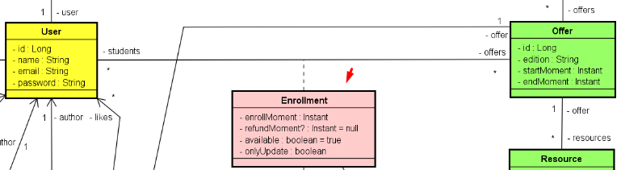

Essa classe será responsável por "linkar" as duas tabelas: User e Offer, fazendo uma relação ManyToMany entre elas, gerando uma chave composta (user_id e offer_id).

❗Chave composta não tem no JPA, então... o que fazer?

Teremos que criar uma classe auxiliar para ser a chave. Ela terá o id do usuário e da oferta. Além disso, essa classe auxiliar será o ID da classe Enrollment. Vamos ver isso abaixo bem detalhado:

Criaremos a entidade Enrollment normalmente seguindo todo o diagrama. Entretanto, seu ID será uma classe criada customizada (conforme falamos acima).

Veja a classe:

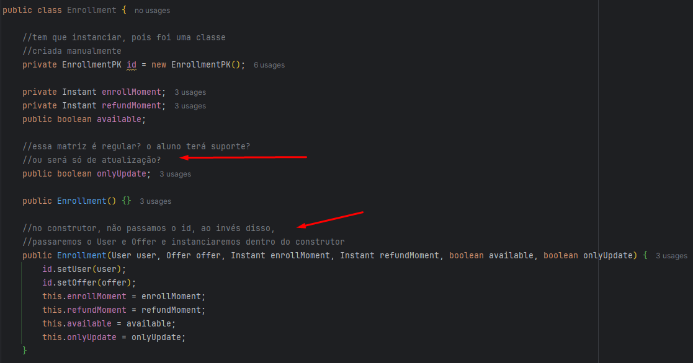

Gerar Getters and Setters, entretando o get e set do Id, ficará diferente.

Faremos de forma customizada, settando o User (student) e a Offer:

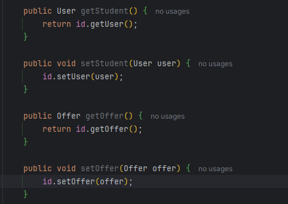

### EnrollmentPK

Criaremos um subpacote em entidades chamado PK, com a classe EnrollmentPK. Ela terá duas referências: para o usuário e offer.

Lembrar de implementar Getter and Setter. O equals&hashCode será comparado as DUAS classes para verificar a matrícula.

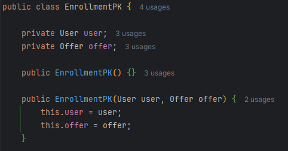

### Mapeamento

Com as duas classes prontas, iremos mapeá-las. Como mapear o EnrollmentPK (quer irá gerar a tabela de associação)?

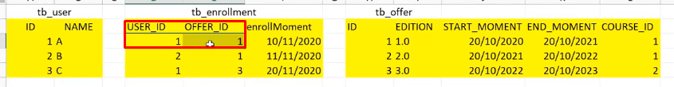

Passaremos o @Embeddable na classe PK. Afinal, ela definirá atributos de outra classe.

Quando temos uma classe que subdivide atributos de outra classe, precisamos passar essa anotação.

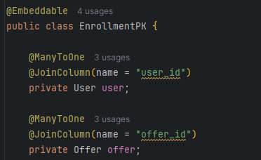

Na classe Enrollment, passaremos o @EmbeddedId

## Lesson (Abstract) (ManyToOne com Section / ManyToMany com Enrollment)

ManyToOne só olhar o resumo ali em cima explicando.

O ManyToMany, como são MUITOS, utilizamos o SET na importação.

❗Nunca colocar coleção (set) em construtor.

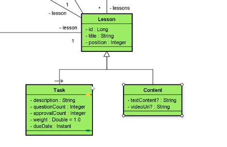

Além disso, precisamos saber o seguinte: uma lesson, nunca será "só lesson". Ou ela será uma task ou um content. Portanto, Lesson na verdade é uma classe abstrata 
(não pode ser instanciada)!

Ou seja, para instanciar uma lesson precisa dar ou ``new Content`` ou ``new Task``.

### Beleza, e as anotações?

Bom, serão as mesmas. Entretanto, teremos uma terceira: ``@Inheritance``.

Essa anotação terá um atributo chamado strategy. Quando vamos implementar uma herança em um banco de dados relacional, precisamos decidir:

1. Se vamos implementar os tipos diferentes em uma tabela só (um tabelão). Neste caso, quando tivermos um tipo e não tiver o outro colocaremos "null".

Por exemplo, vamos instanciar um Task. Os atributos ``textContent`` e ``videoUri`` estarão null.

2. Outra estratégia é criar UMA TABELA PARA CADA ENTIDADE e depois relacioná-las com chave estrangeira (essa é ideal quando se tem muitos campos que possivelmente ficarão null).

Adotaremos a opção 2.

⬇️ Assim, criará as três tabelas! LEMBRANDO, as outras duas entidades estão dando extend na Lesson, visto que ela é abstract.

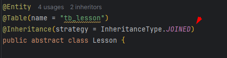


### ManyToMany (Com chave PK)

Para falarmos quando um aluno que está matriculado (Classe Enrollment) terminou cada lição (Lesson), precisamos da relação ManyToMany, veja o exemplo da tabela abaixo:

Ela terá o ID do usuário, sua offer e lição que ele terminou.

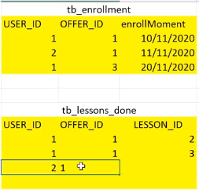

O primeiro JoinColumn é sempre o nome da classe que estamos, neste caso, Lesson.

Só que o inverseJoinColumns não será como foi feito no User, visto que a classe Enrollment (matrícula), tem uma chave composta.

Dentro da nossa matrícula, temos User e Offer. Então dentro do inverseJoinColumns, abrimos uma chave adicionando dois JoinColumn's,
ficando igual a tabela acima.

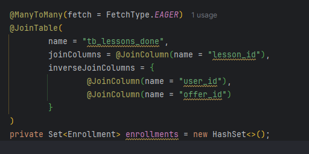

#### Classe Enrollment com ManyToMany

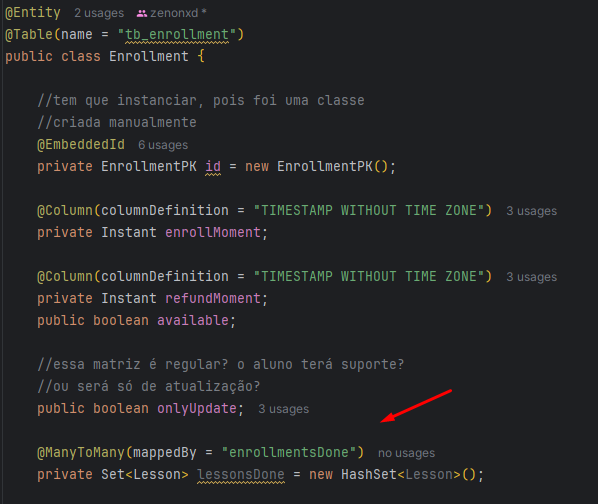

## Task

❗Lembrar de ver tudo que está escrito na parte da classe abstrata principal (Lesson).

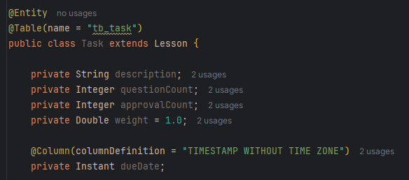

## Content

❗Lembrar de ver tudo que está escrito na parte da classe abstrata principal (Lesson).

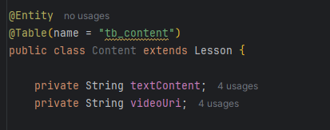

## Topic

Para armazenar os likes de um tópico, fazemos uma tabela de associação (ManyToMany).

Teremos User e Topic, e logo, sua tabela de associação "topic_likes".

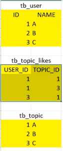

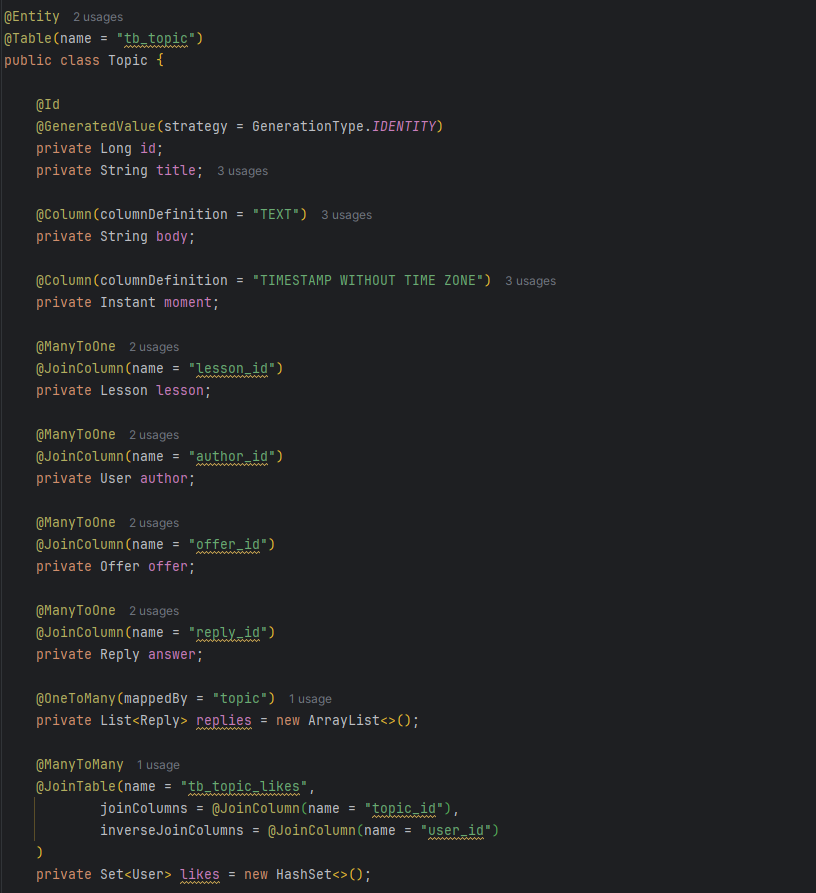

## Reply

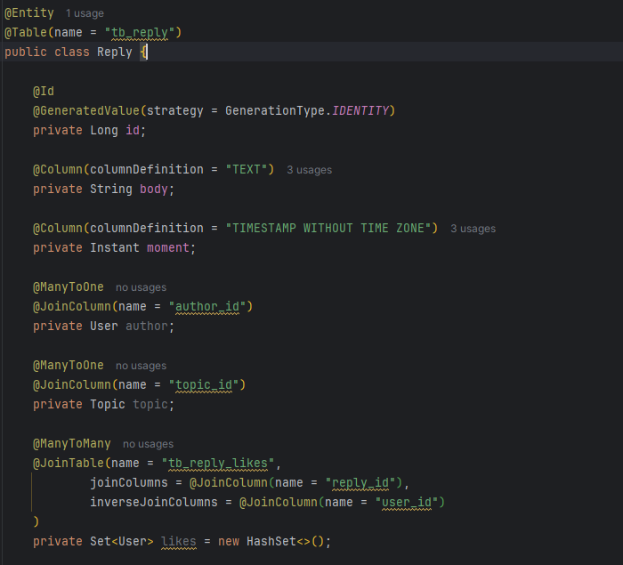
